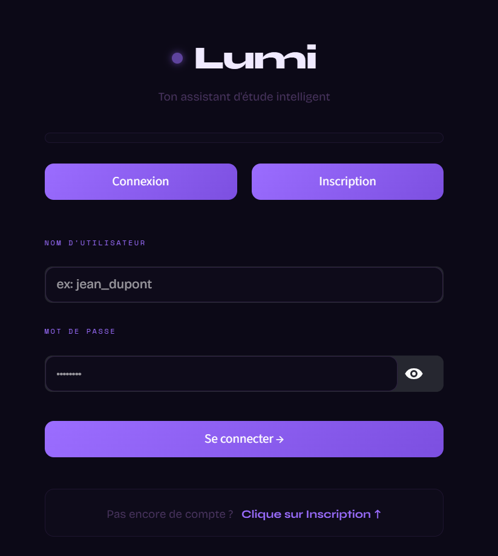
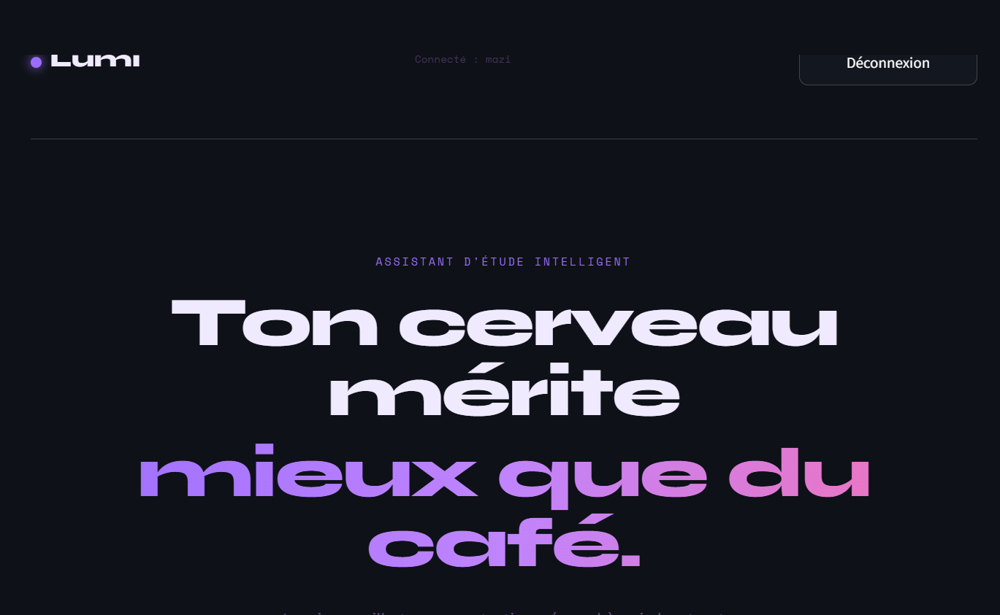
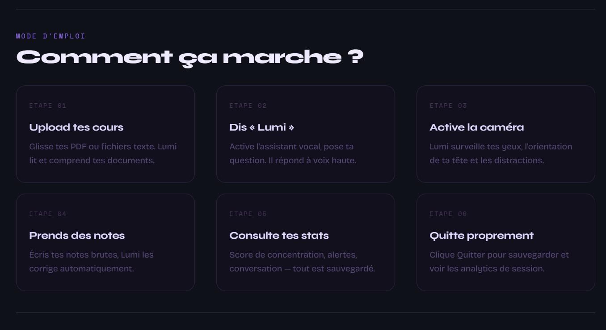
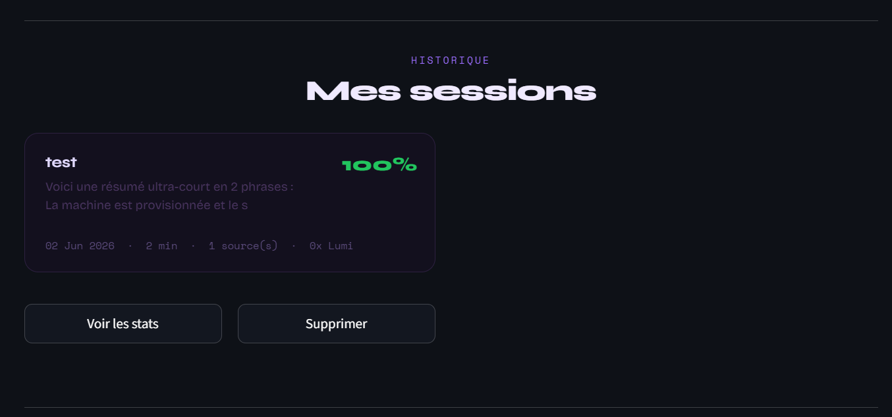
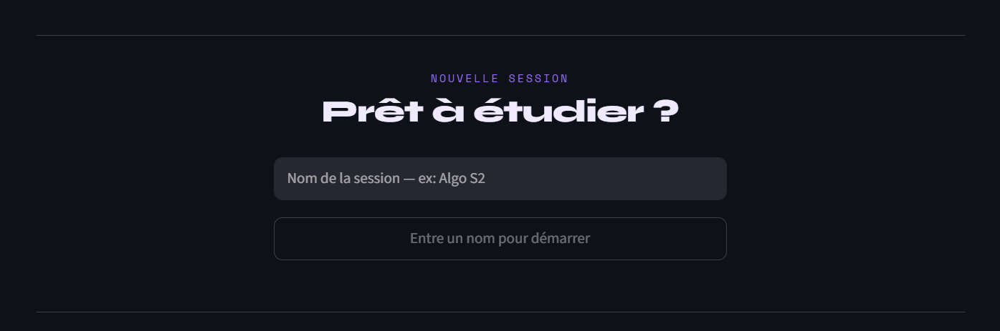

# LUMI — Assistant d'étude intelligent

<div align="center">

```
  ●  LUMI
```

**L'assistant qui t'écoute, te surveille et t'aide à rester concentré.**


---

*Master SISE 2025–2026*
**Aya Mecheri · Maissa Lajimi · Mazilda Zehraoui**

</div>

---

## ✦ Aperçu

<div align="center">

| Authentification | Accueil |
|:---:|:---:|
|  |  |

| Mode d'emploi | Historique des sessions |
|:---:|:---:|
|  |  |

| Nouvelle session |  |
|:---:|:---:|
|  | |

</div>

---

## ✦ Présentation

**Lumi** est une application web d'assistance à l'étude développée avec Streamlit. Elle combine la détection de concentration par caméra, un assistant vocal intelligent, et un chatbot contextuel pour accompagner l'étudiant tout au long de ses sessions de travail.

```
┌─────────────────────────────────────────────────────┐
│                                                     │
│   ●  Lumi        [ 12:34 ]         [ Quitter ]      │
│                                                     │
│  ┌─────────────┐  ┌───────────────────────────┐    │
│  │  SOURCES    │  │  📷 Caméra   │  Score 87% │    │
│  │  cours.pdf  │  │              │  EAR 0.34  │    │
│  │  tp1.txt    │  │  [ Calibrer ]│            │    │
│  └─────────────┘  └───────────────────────────┘    │
│                                                     │
│  [ Sources ]  [ Lumi ]  [ Résumé ]                  │
│                                                     │
└─────────────────────────────────────────────────────┘
```

---

## ✦ Démo en ligne

🔗 **[Essayer Lumi sur Streamlit](https://m3dc3mfjfxh4ttqcfwzz3j.streamlit.app/)**

> ⚠️ **Limitations de la démo en ligne**
> Streamlit Cloud étant un serveur distant, il ne dispose pas d'accès à la webcam ni au microphone.
> Les fonctionnalités de détection et d'assistant vocal nécessitent une **installation locale**.

| Fonctionnalité | Démo en ligne | Local |
|---|:---:|:---:|
| 💬 Chat contextuel (LLM) | ✅ | ✅ |
| 📊 Analytics de session | ✅ | ✅ |
| 🔐 Authentification sécurisée | ✅ | ✅ |
| 📄 Export résumé PDF | ✅ | ✅ |
| 👁 Détection webcam (MediaPipe) | ❌ | ✅ |
| 🎙 Assistant vocal (Whisper) | ❌ | ✅ |

---

## ✦ Fonctionnalités

| Fonctionnalité | Description |
|---|---|
| 👁 **Détection faciale** | Analyse EAR (clignements), bâillements, orientation tête |
| 🎙 **Assistant vocal** | Wake word "Lumi", transcription Whisper, réponse TTS |
| 💬 **Chat contextuel** | Questions/réponses basées sur les sources uploadées |
| 📊 **Analytics** | Timeline de concentration, KPIs, rapport LLM de session |
| 📄 **Résumé PDF** | Export du résumé de session en PDF stylé |
| 🔐 **Authentification** | Inscription/connexion sécurisée avec bcrypt |

---

## ✦ Stack technique

```
┌──────────────────────────────────────────────────┐
│  FRONTEND          │  BACKEND / IA               │
│  ─────────────     │  ──────────────────         │
│  Streamlit 1.32    │  Groq API (Llama 3.1-8b)   │
│  streamlit-webrtc  │  Whisper v3 (transcription) │
│  HTML/CSS inline   │  MediaPipe (vision)         │
│                    │  OpenCV 4.9                 │
│  VOIX / AUDIO      │  BASE DE DONNÉES            │
│  ─────────────     │  ──────────────────         │
│  gTTS              │  SQLite (9 tables)          │
│  sounddevice       │  bcrypt (auth)              │
│  soundfile         │                             │
│  playsound         │  EXPORT                     │
│                    │  ──────────────────         │
│                    │  fpdf2 (PDF)                │
│                    │  PyPDF2 (lecture PDF)        │
└──────────────────────────────────────────────────┘
```

---

## ✦ Installation locale

### Prérequis
- Python 3.10+
- Webcam + Microphone
- Clé API Groq (gratuite sur [console.groq.com](https://console.groq.com))

### Étapes

```bash
# 1. Cloner le projet
git clone https://github.com/ZehraouiMazilda/Lumi/
cd lumi

# 2. Créer l'environnement virtuel
python -m venv lumi-env
source lumi-env/bin/activate      # Linux/Mac
lumi-env\Scripts\activate         # Windows

# 3. Installer les dépendances
pip install -r requirements.txt

# 4. Configurer la clé API
echo "GROQ_API_KEY=votre_cle_ici" > .env

# 5. Lancer l'application
streamlit run app.py
```

---

## ✦ Structure du projet

```
lumi/
│
├── app.py                    # Point d'entrée, routing des pages
├── database.py               # Schéma SQLite + toutes les requêtes
├── requirements.txt          # Dépendances Python
├── .env                      # Clé API Groq (non versionné)
│
├── views/                    # Pages de l'application
│   ├── auth.py               # Connexion / Inscription
│   ├── home.py               # Accueil, historique sessions
│   ├── session.py            # Session d'étude principale
│   └── analytics.py          # Rapports et statistiques
│
├── services/                 # Logique métier
│   ├── vision.py             # Détection faciale MediaPipe
│   ├── voice_detector.py     # Wake word + Whisper + TTS
│   ├── concentration_engine.py  # Score de concentration
│   ├── cursor_tracker.py     # Suivi activité souris/onglets
│   └── sound.py              # Utilitaires audio
│
└── docs/
    ├── screenshots/          # Captures d'écran
    └── README_PAGES.md       # Documentation détaillée des pages
```

---

## ✦ Variables d'environnement

| Variable | Description | Obligatoire |
|---|---|---|
| `GROQ_API_KEY` | Clé API Groq pour Llama 3.1 et Whisper | ✅ Oui |

---

## ✦ Documentation

La documentation complète des pages est disponible dans [`docs/README_PAGES.md`](docs/README_PAGES.md).

---

<div align="center">
<sub>● LUMI · Master SISE 2025–2026 · Dernière mise à jour : Juin 2026 · Python · Streamlit · Groq · MediaPipe</sub>
</div>
